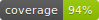

# Shopify Storefront Checkout



## Description

Library that embeds Shopify Storefront Checkout

- Storefront API version: `2022-04`

## Install

```shell
composer require irishdistillers/shopify-storefront-checkout
```

## Usage

You can access cart in two ways:

### Cart service

- each operation will return a cart ID, that can be used to change cart items and attributes, and to get checkout URL

### Cart object

- wrapper for cart service
- cart ID and country code are embedded in the object.

### Sample code

#### Cart service

```php
use Irishdistillers\ShopifyStorefrontCheckout\CartService;
use Irishdistillers\ShopifyStorefrontCheckout\Shopify\Context;

// Set StoreFront access token
$storeFrontAccessToken = 'b3f1f61693cae*******************';

// Create context
$context = new Context('my_shop.shopify.com', '2022-04', $storeFrontAccessToken);

// Create cart service
$cartService = new CartService($context);

// Create new cart, for Ireland market
$cartId = $cartService->getNewCart('IE');

// Add products to the cart
$cartService->addLines($cartId, [
    ['gid://shopify/ProductVariant/1234567890' => 1],
]);

// Add discount codes to the cart
$cartService->updateDiscountCodes($cartId, 'TENPERCENT');

// Get checkout URL for United Kingdom market
$checkoutUrl = $cartService->getCheckoutUrl($cartId, 'GB');

// Checkout URL is immutable. Once paid, the URL won't work anymore.
```

#### Cart object

```php
use Irishdistillers\ShopifyStorefrontCheckout\Cart;
use Irishdistillers\ShopifyStorefrontCheckout\Shopify\Context;

// Set StoreFront access token
$storeFrontAccessToken = 'b3f1f61693cae*******************';

// Create context
$context = new Context('my_shop.shopify.com', '2022-04', $storeFrontAccessToken);

// Create cart object
$cartObj = new Cart($context);

// Set Ireland market
$cartObj->setCountryCode('IE');

// Create new cart
$cartObj->getNewCart();

// Add products to the cart
$cartObj->addLines([
    ['gid://shopify/ProductVariant/1234567890' => 1],
]);

// Add discount codes to the cart
$cartObj->updateDiscountCodes('TENPERCENT');

// Change market to the United Kingdom and get checkout URL
$checkoutUrl = $cartObj->setCountryCode('GB')->getCheckoutUrl();

// Checkout URL is immutable. Once paid, the URL won't work anymore.
```

